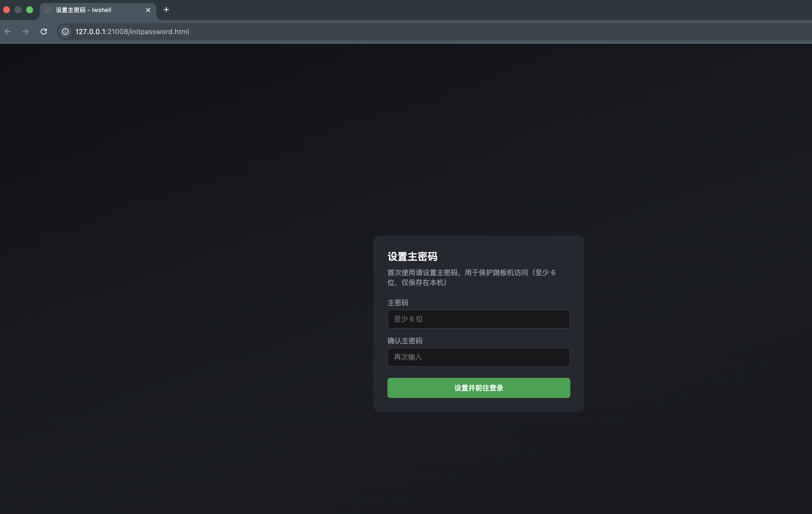
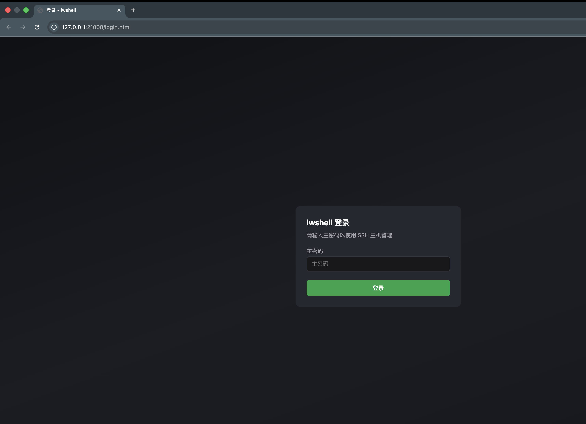
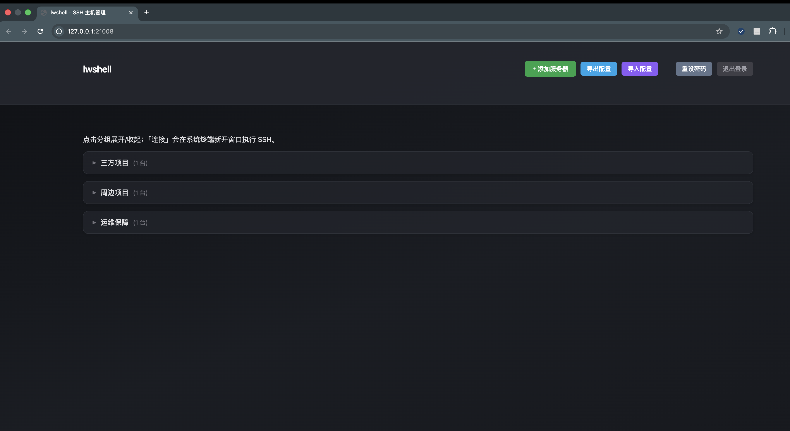

# 灵王shell

基于 Go 的 SSH Macos系统本地的主机管理工具，通过 **Web 页面** 管理服务器列表、分组、连接，支持主密码保护、配置导出导入与访问日志。

---

## 界面预览

| 首次使用：设置主密码 | 登录界面 | 管理服务器 |
|----------------------|----------|------------|
|  |  |  |

*01 - 首次使用设置主密码 · 02 - 登录界面 · 03 - 主机列表与连接管理*

---

## 功能概览

| 功能 | 说明 |
|------|------|
| **主密码** | 首次访问设置主密码，之后仅显示登录页；登录后可「重设密码」。主密码以 bcrypt 哈希存储，不存明文。 |
| **主机管理** | 按分组展示；支持添加 / 编辑 / 删除服务器；每台主机可填密码或私钥路径（或两者都填）。 |
| **连接** | 点击「连接」在系统终端新开窗口执行 SSH，可多窗口同时连；终端标题固定为服务器名，便于区分。 |
| **导出 / 导入** | 导出为 JSON（含主机密码），支持「替换全部」或「与当前合并」导入，便于迁移或备份。 |
| **访问日志** | 每次通过 Web 发起的 SSH 连接（成功或失败）都会写入本地日志文件。 |

---

## 使用方式

### 命令行启动

```bash
go mod tidy
go build -o lwshell ./cmd/lwshell/
./lwshell
```

默认在 `http://127.0.0.1:21008` 启动 Web 服务。**启动前会自动关闭占用该端口的进程**（避免重复启动需先手动关旧服务）。指定端口：

```bash
./lwshell --http=:9000
```

### macOS 应用（.app）

```bash
chmod +x build-app.sh
./build-app.sh              # 当前架构（本机）
./build-app.sh universal     # 通用二进制（arm64 + amd64）
```

将生成的 **lwshell.app** 拖到「应用程序」，双击即可：会弹出终端并打开浏览器，首次为「设置主密码」，之后为「登录」，登录后进入主机管理。**关闭终端窗口即停止 Web 服务。**

---

## 配置与数据存储

所有数据均在当前用户的**配置目录**下的 `lwshell` 子目录中。路径由 Go 的 `os.UserConfigDir()` 决定，因系统而异：

| 系统 | 配置目录（基础路径） |
|------|----------------------|
| **macOS** | `~/Library/Application Support/lwshell/` |
| **Linux / 其他** | `~/.config/lwshell/`（或 `$XDG_CONFIG_HOME/lwshell/`） |

（`~` 即用户主目录，如 macOS 上 `/Users/你的用户名`。）

| 用途 | 相对路径（在上述目录下） | 说明 |
|------|--------------------------|------|
| **主密码（Web 登录）** | `.auth_hash` | 主密码的 **bcrypt 哈希**，不存明文；目录权限 0700，文件 0600。 |
| **主机信息（服务器列表）** | `servers.json` | JSON：每台主机的 id、name、host、port、user、**password**（SSH 密码）、key_path、group。**主机密码在此文件中为明文**，备份或导出时需妥善保管。 |
| **访问日志** | `access.log` | 每次连接尝试一行：时间(UTC)、主机 id/name/host/port/user、成功或失败，失败时带错误信息。 |

**macOS 下完整路径示例**：`/Users/你的用户名/Library/Application Support/lwshell/servers.json`、`.auth_hash`、`access.log`。

### 主密码放在哪里？

- **Web 登录用的主密码**：只存哈希。macOS 上为 `~/Library/Application Support/lwshell/.auth_hash`，Linux 上为 `~/.config/lwshell/.auth_hash`，不存明文。

### 主机信息放在哪里？

- **服务器列表及每台主机的 SSH 密码/私钥路径**：macOS 上在 `~/Library/Application Support/lwshell/servers.json`，Linux 上在 `~/.config/lwshell/servers.json`；其中主机密码（`password` 字段）为明文。

---

## 命令行参数

| 参数 | 说明 |
|------|------|
| 无参数 | 启动 Web 服务，默认监听 `:21008`；启动前会先关闭占用该端口的进程。 |
| `--http=:端口` | 指定 Web 监听地址，如 `--http=:9000`；同样会先关闭该端口上的旧进程再启动。 |
| `--connect-id=ID` | 供 Web 在「新终端」中调用，直接连接指定 ID 的服务器；一般无需手动使用。 |

---

## 认证与安全

- **首次访问**：未检测到 `.auth_hash` 时，仅显示「设置主密码」页，设置成功后跳转登录。
- **之后访问**：仅显示登录页；登录成功后下发 **HttpOnly** 会话 Cookie，有效期 **24 小时**。
- **受保护接口**：获取服务器列表、连接、增删改服务器、导出、导入、重设密码等均需已登录；未登录或会话过期返回 401。
- **导出文件**：导出 JSON 包含主机密码明文，请勿泄露或存放在不安全位置。

---

## 访问日志格式

`access.log` 每行一条记录，字段用空格分隔。每次点击「连接」会先写一条 `status=started`，会话结束后再写一条 `success` 或 `failure`，示例：

```
2025-01-30T12:00:00Z connect id=1 name=my-server host=192.168.1.1 port=22 user=root status=started
2025-01-30T12:00:05Z connect id=1 name=my-server host=192.168.1.1 port=22 user=root success
2025-01-30T12:01:00Z connect id=2 name=prod host=10.0.0.1 port=22 user=admin status=started
2025-01-30T12:01:01Z connect id=2 name=prod host=10.0.0.1 port=22 user=admin failure err="connection refused"
```

---

## 环境要求

- **Go**：1.21 及以上（见 `go.mod`）。
- **macOS .app**：仅在 macOS 下运行 `build-app.sh`；通用二进制需本机已安装 Xcode 命令行工具（含 `lipo`）。

---

## 项目结构（简要）

```
lwshell/
├── cmd/lwshell/              # 主程序
│   ├── main.go               # 入口：Web 服务 / --connect-id
│   └── web/                  # 前端页面（embed）
│       ├── index.html        # 主界面（主机列表、连接、导出导入等）
│       ├── login.html        # 登录
│       └── initpassword.html # 首次设置主密码
├── internal/
│   ├── auth/                 # 主密码、会话、登录/登出/重设
│   ├── config/               # servers.json 读写
│   ├── models/               # Server、Config 等结构
│   ├── server/               # HTTP API：服务器 CRUD、连接、导出导入
│   ├── ssh/                  # SSH 连接与终端标题
│   └── audit/                # 访问日志
├── build-app.sh              # 打包 macOS .app
├── go.mod / go.sum
└── README.md
```

---

## 常见问题

- **忘记主密码**：删除配置目录下的 `.auth_hash`（macOS：`~/Library/Application Support/lwshell/.auth_hash`，Linux：`~/.config/lwshell/.auth_hash`）后重新打开 Web，会再次出现「设置主密码」页；服务器列表仍在 `servers.json`，不受影响。
- **只想迁移主机列表**：使用 Web 内「导出」下载 JSON，在新机器上「导入」并选择「替换」或「合并」即可。
- **连接时终端标题被远程改掉**：程序在连接期间会定期刷新终端标题，若仍被覆盖，多为终端或 SSH 服务端行为，可尝试换终端（如 iTerm2）。

---

## 开源协议

本项目采用 [MIT License](LICENSE) 开源。
